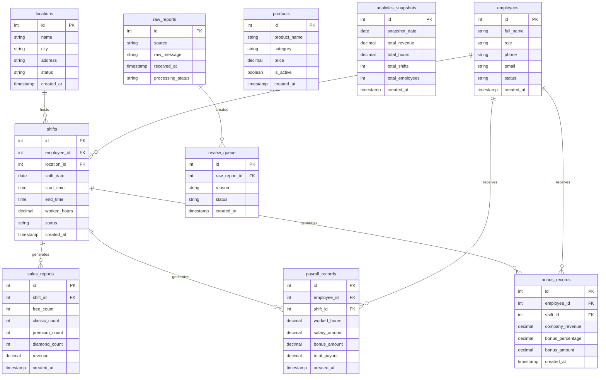

# Entity Relationship Diagram

```mermaid
erDiagram

    employees {
        int id PK
        string full_name
        string role
        string phone
        string email
        string status
        timestamp created_at
    }

    locations {
        int id PK
        string name
        string city
        string address
        string status
        timestamp created_at
    }

    products {
        int id PK
        string product_name
        string category
        decimal price
        boolean is_active
        timestamp created_at
    }

    shifts {
        int id PK
        int employee_id FK
        int location_id FK
        date shift_date
        time start_time
        time end_time
        decimal worked_hours
        string status
        timestamp created_at
    }

    sales_reports {
        int id PK
        int shift_id FK
        int free_count
        int classic_count
        int premium_count
        int diamond_count
        decimal revenue
        timestamp created_at
    }

    analytics_snapshots {
        int id PK
        date snapshot_date
        decimal total_revenue
        decimal total_hours
        int total_shifts
        int total_employees
        timestamp created_at
    }

    employees ||--o{ shifts : works
    locations ||--o{ shifts : hosts
    shifts ||--o{ sales_reports : generates

        raw_reports {
        int id PK
        string source
        string raw_message
        timestamp received_at
        string processing_status
    }

    review_queue {
        int id PK
        int raw_report_id FK
        string reason
        string status
        timestamp created_at
    }

    payroll_records {
        int id PK
        int employee_id FK
        int shift_id FK
        decimal worked_hours
        decimal salary_amount
        decimal bonus_amount
        decimal total_payout
        timestamp created_at
    }

    bonus_records {
        int id PK
        int employee_id FK
        int shift_id FK
        decimal company_revenue
        decimal bonus_percentage
        decimal bonus_amount
        timestamp created_at
    }

    raw_reports ||--o{ review_queue : creates
    employees ||--o{ payroll_records : receives
    shifts ||--o{ payroll_records : generates
    employees ||--o{ bonus_records : receives
    shifts ||--o{ bonus_records : generates
```
